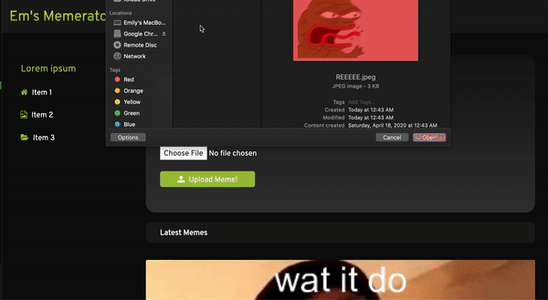

# Meme Generator Project

[Live demo](https://em-meme-maker.herokuapp.com/)

## User Story
* User can upload only png, jpg, jpeg, gif files
* Users can use original images to make new memes
* User can add text on top or bottom of the images
* Users can see all original images, and the images are available for use to all users.
* User can see all memes made by other users.

## Objectives
* Understand how middleware works
* Know how to use middleware
* Handle file upload
* Manipulate image files
* Practice express router
* Practice reading documentations 😀

